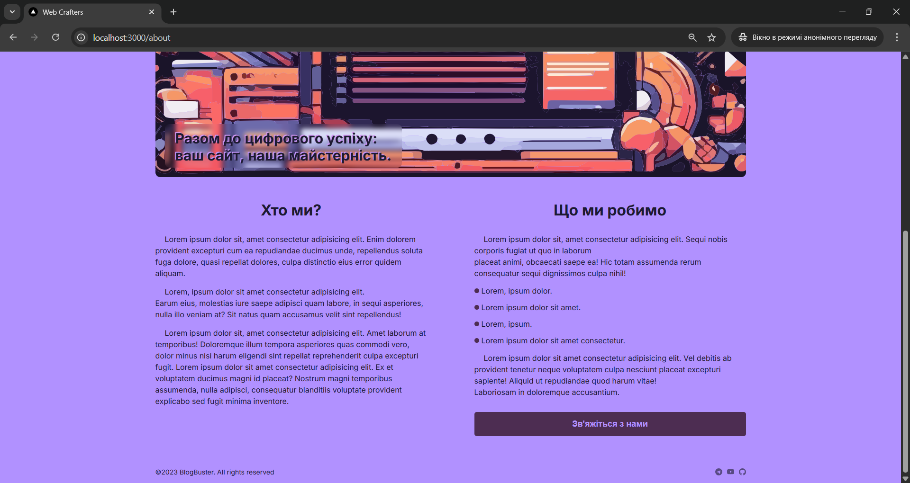

Blog Platform – Next.js 13 (Legacy Project)

This is an older personal project, a simple blog application built with Next.js 13 and JavaScript.
The project implements full CRUD functionality for managing blog posts and integrates user authentication and a database:

NextAuth.js for authentication and session management

MongoDB with Mongoose for storing posts and user data

Dynamic routing for individual post pages

Server-side rendering for improved SEO

Clean, minimalistic user interface

Modern app directory structure introduced in Next.js 13

This project served as a learning example for building a basic content management system with Next.js, authentication, and MongoDB.

## Screenshots

### Home page

### Dashboard page

### About page.

### Contact page.

### Portfolio page.

### Blog page.

### Post page.

